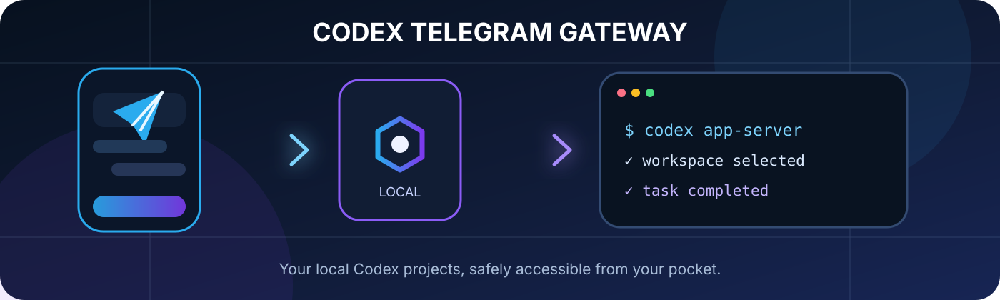
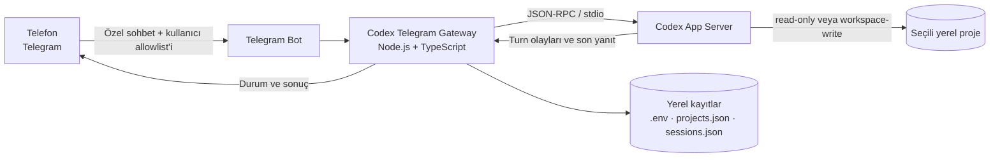
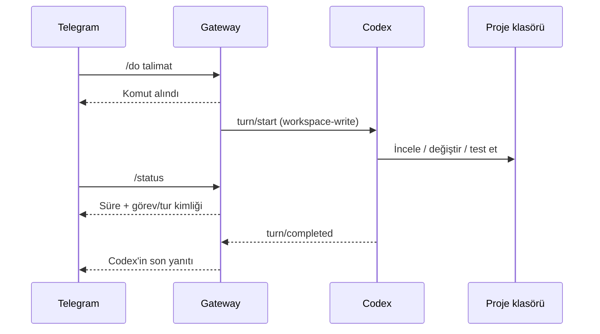

<p align="center">
  
</p>

<p align="center">
  <a href="https://github.com/ibrahimethemkurt/codex_telegram_bot/actions/workflows/ci.yml"></a>
  
  
  
</p>

<p align="center">
  Telefonunuzdan güvenli biçimde yerel Codex projelerinizi seçin, soru sorun, görev başlatın ve sonuçları Telegram'da alın.
</p>

> [!IMPORTANT]
> Bu bağımsız bir topluluk projesidir; OpenAI veya Telegram'ın resmi ürünü değildir. Gateway kendi bilgisayarınızda çalışır. Bilgisayar kapalıysa bot görev çalıştıramaz.

## Neler yapabilir?

| Özellik | Açıklama |
| --- | --- |
| Çoklu proje | Tek bot üzerinden birden fazla yerel proje seçilir. |
| Mevcut göreve devam | Codex görev geçmişleri listelenir ve istenen göreve bağlanılır. |
| Salt okunur soru | `/ask` projeyi değiştirmeden inceleme yapar. |
| Projede değişiklik | `/do` yalnızca seçili proje klasöründe yazma izniyle çalışır. |
| Canlı durum | `/status`, uzun görev sürerken bile anında süre ve görev kimliğini gösterir. |
| Sonuç bildirimi | Telegram'dan veya Codex masaüstünden tamamlanan işlerin son yanıtı telefona gönderilir. |
| Otomatik keşif | Belirlenen klasörlerdeki Git, Node.js, Python, .NET, Rust ve Go projeleri bulunur. |
| Güvenli erişim | Özel sohbet zorunludur ve Telegram kullanıcı ID allowlist'i uygulanır. |

## Mimari



Gateway, Codex App Server'ı yalnızca yerel `stdio` bağlantısıyla başlatır; dışarıya App Server portu açmaz. Codex App Server; kimlik doğrulama, görev geçmişi ve akış olayları sağlayan resmi entegrasyon arayüzüdür. Ayrıntılar için [OpenAI Codex App Server belgelerine](https://learn.chatgpt.com/docs/app-server) bakın.

### Bir `/do` komutunun akışı



## Gereksinimler

- [Node.js](https://nodejs.org/) 20 veya üstü
- Git
- Kurulmuş ve hesabınıza giriş yapılmış Codex Desktop veya Codex CLI
- Telegram hesabı

Windows'ta gateway, Codex Desktop'ın sürümlü `codex.exe` yolunu otomatik bulur. macOS ve Linux'ta `codex` komutunun `PATH` üzerinde olması gerekir. Özel kurulumlarda `.env` içindeki `CODEX_BIN` alanına çalıştırıcının mutlak yolu yazılabilir.

## Hızlı kurulum

### 1. Depoyu indirin

```bash
git clone https://github.com/ibrahimethemkurt/codex_telegram_bot.git
cd codex_telegram_bot
npm ci
npm run setup
```

`npm run setup`, yoksa `.env` ile yerel `config/projects.json` dosyalarını oluşturur. Var olan dosyaları veya gizli değerleri değiştirmez.

### 2. Telegram botu oluşturun

1. Telegram'da doğrulanmış [`@BotFather`](https://t.me/BotFather) hesabını açın.
2. `/newbot` yazın.
3. Görünen ad ve `bot` ile biten kullanıcı adı belirleyin.
4. BotFather'ın verdiği tokenı kopyalayın.
5. Projedeki `.env` dosyasını açıp tokenı ekleyin:

```dotenv
TELEGRAM_BOT_TOKEN=BOTFATHER_TOKENINIZ
TELEGRAM_ALLOWED_USER_IDS=
```

Tokenı README'ye, ekran görüntüsüne, terminal komutuna veya GitHub'a koymayın.

### 3. Kendi Telegram ID'nizi alın

İlk çalıştırma:

```bash
npm run dev
```

Botla **özel sohbet** açın ve şunu gönderin:

```text
/whoami
```

Botun döndürdüğü yalnızca rakamlardan oluşan ID'yi `.env` içine yazın:

```dotenv
TELEGRAM_ALLOWED_USER_IDS=123456789
```

Gateway'i `Ctrl+C` ile kapatıp tekrar başlatın:

```bash
npm run dev
```

Birden fazla kullanıcıya izin vermek için ID'leri virgülle ayırabilirsiniz:

```dotenv
TELEGRAM_ALLOWED_USER_IDS=123456789,987654321
```

> [!WARNING]
> Allowlist'e eklenen her kullanıcı, bu bilgisayarda gateway'in keşfettiği projelere erişebilir. Her kullanıcının kendi bilgisayarında ve kendi Telegram botuyla kurulum yapması en güvenli yöntemdir.

### 4. Projeleri bulun

Telegram'da:

```text
/projects
```

Varsayılan olarak kullanıcının `Desktop` ve `Documents` klasörleri taranır. Projeler başka bir yerdeyse `.env` içindeki `PROJECT_ROOTS` değerini değiştirin:

```dotenv
# Windows — noktalı virgülle ayırın
PROJECT_ROOTS=C:\Code;D:\Projects

# macOS / Linux — iki noktayla ayırın
PROJECT_ROOTS=/Users/me/Code:/opt/projects
```

Ardından Telegram'da `/sync` yazın.

### 5. Kurulumu doğrulayın

```bash
npm run doctor
npm run check
```

`doctor` Node.js, `.env`, Telegram yapılandırması, Codex çalıştırıcısı ve proje köklerini kontrol eder; token değerini ekrana yazmaz.

## Kullanım

Önerilen ilk akış:

```text
/ping
/projects
/threads
/ask Bu projenin mevcut durumunu özetle
/do Testleri çalıştır ve bulunan hatayı düzelt
/status
```

### Telegram komutları

| Komut | İşlev |
| --- | --- |
| `/start`, `/help` | Komut yardımını gösterir. |
| `/whoami` | Kendi sayısal Telegram kullanıcı ID'nizi gösterir. |
| `/ping` | Gateway'in açık olduğunu doğrular. |
| `/projects` | Projeleri tarar ve seçim menüsünü açar. |
| `/sync` | Yeni veya taşınmış projeleri tekrar tarar. |
| `/use <slug>` | Projeyi slug değeriyle seçer. |
| `/current` | Aktif proje ve bağlı görevi gösterir. |
| `/threads` | Seçili projedeki Codex görevlerini listeler. |
| `/latest` | En son Codex görevine bağlanır. |
| `/new` | Seçili projede yeni bir görev oluşturur. |
| `/ask <soru>` | Salt okunur inceleme yapar. |
| `/do <talimat>` | Seçili proje içinde değişiklik yapabilir. |
| `/status` | Devam eden görevin süresini ve kimliklerini gösterir. |
| `/stop` | Gateway'in başlattığı aktif görevi durdurur. |

Komutsuz normal mesajlar güvenlik amacıyla `/ask` gibi salt okunur çalışır.

## Codex görevleri nasıl seçilir?

Proje seçildiğinde gateway o klasördeki en son Codex görevini bağlar. `/threads` ile başka bir görev seçebilirsiniz. Seçili görev Codex masaüstünde başka bir yazıcı tarafından aktif kullanılıyorsa gateway geçmişi koruyarak yeni bir `Telegram · ...` dalı açar; böylece masaüstündeki aktif görev bozulmaz.

Telegram görevi uzun sürerken `/status` ve `/stop` bloke olmaz. Görev tamamlanınca Codex'in son yanıtı Telegram'a gönderilir. Masaüstünde tamamlanan görevler de varsayılan olarak beş saniyede bir izlenir.

## Yapılandırma

| Değişken | Zorunlu | Varsayılan | Açıklama |
| --- | --- | --- | --- |
| `TELEGRAM_BOT_TOKEN` | Evet | — | BotFather gizli tokenı. |
| `TELEGRAM_ALLOWED_USER_IDS` | Güvenli kullanım için evet | boş/kilitli | Virgülle ayrılmış kullanıcı ID'leri. |
| `PROJECTS_FILE` | Hayır | `./config/projects.json` | Otomatik oluşturulan yerel proje kayıtları. |
| `SESSIONS_FILE` | Hayır | `./data/sessions.json` | Kullanıcıların proje/görev seçimleri. |
| `DESKTOP_MONITOR_FILE` | Hayır | `./data/desktop-monitor.json` | Bildirim tekrarlarını engelleyen yerel durum. |
| `DESKTOP_MONITOR_INTERVAL_MS` | Hayır | `5000` | Masaüstü görev kontrol sıklığı; 2000–60000 ms. |
| `CODEX_BIN` | Hayır | `codex` | Codex çalıştırıcısı veya mutlak yolu. |
| `CODEX_MODEL` | Hayır | boş | Boşsa Codex'in varsayılan modeli kullanılır. |
| `PROJECT_ROOTS` | Hayır | Desktop + Documents | Proje tarama kökleri. |
| `PROJECT_SCAN_MAX_DEPTH` | Hayır | `4` | Taramanın ulaşabileceği azami derinlik. |
| `PROJECT_AUTO_ADD_DEPTH` | Hayır | `1` | Otomatik allowlist'e alınacak proje derinliği. |

Proje kayıtları makineye özeldir. `config/projects.json` otomatik oluşturulur ve Git tarafından yok sayılır; depoda yalnızca `config/projects.example.json` bulunur.

## Güvenlik modeli

Gateway'in güvenlik sınırları bilinçli olarak dar tutulur:

- Bot grup ve kanal komutlarını reddeder; yalnızca özel sohbet çalışır.
- Kullanıcı kimliği `TELEGRAM_ALLOWED_USER_IDS` allowlist'iyle doğrulanır.
- `.env`, proje yolları, oturumlar ve izleme durumu Git'e eklenmez.
- Codex App Server yalnızca yerel `stdio` üzerinden bağlanır; ağ portu açılmaz.
- `/ask`, `read-only` sandbox kullanır.
- `/do`, yalnızca seçili projenin klasörünü `workspace-write` yapar.
- Codex görevleri için ağ erişimi kapalıdır.
- `danger-full-access` kullanılmaz ve beklenmeyen yetki talepleri reddedilir.
- Bağımlılık sürümleri sabitlenir, CI her push'ta test ve gizli bilgi taraması çalıştırır.
- `npm run security:check`, takip edilen dosyalarda token, API anahtarı ve özel anahtar kalıplarını değerleri göstermeden denetler.

> [!CAUTION]
> `/do`, seçili klasörde dosya değiştirebilir ve komut çalıştırabilir. Yalnızca güvendiğiniz kişileri allowlist'e ekleyin; önemli projelerde Git kullanın ve değişiklikleri commit etmeden önce inceleyin.

### Bir token yanlışlıkla paylaşıldıysa

1. BotFather'da `/revoke` ile Telegram tokenını hemen geçersiz kılın.
2. Yeni tokenı yalnızca yerel `.env` dosyasına yazın.
3. `npm run security:check` çalıştırın.
4. Token commit edildiyse yalnızca dosyayı silmek yetmez; Git geçmişini temizleyin ve tokenı yine de döndürün.

Güvenlik açığı bildirmek için [SECURITY.md](./SECURITY.md) dosyasını kullanın. Token veya kişisel yol içeren herkese açık GitHub issue açmayın.

## Üretim şeklinde çalıştırma

Geliştirme sırasında:

```bash
npm run dev
```

Derlenmiş sürüm:

```bash
npm run check
npm start
```

Gateway'in kesintisiz çalışması için işletim sisteminizde kullanıcı hesabınıza ait bir başlangıç görevi veya süreç yöneticisi kullanabilirsiniz. Aynı bot tokenıyla aynı anda iki gateway çalıştırmayın; Telegram long-polling çakışması oluşur.

## Sorun giderme

### `spawn codex ENOENT`

- `npm run doctor` çalıştırın.
- Terminalde `codex --version` deneyin.
- Windows Codex Desktop otomatik bulunamazsa `.env` içinde `CODEX_BIN` için gerçek `codex.exe` yolunu belirtin.
- macOS/Linux'ta Codex CLI'ın `PATH` üzerinde olduğundan emin olun.

### “Yerel proje bulunamadı”

`PROJECT_ROOTS` değerini proje klasörlerinizi kapsayacak biçimde ayarlayın ve `/sync` yazın. Otomatik keşif `.git`, `.codex`, `AGENTS.md`, `package.json`, `pyproject.toml`, `go.mod`, `Cargo.toml`, `.sln` gibi işaretleri kullanır.

### Bot “Gateway kilitli” diyor

Özel sohbette `/whoami` yazın, dönen ID'yi `TELEGRAM_ALLOWED_USER_IDS` alanına ekleyin ve gateway'i yeniden başlatın.

### `/status` boşta gösteriyor

`/current` ile seçili projeyi kontrol edin. Görev başka projede başladıysa önce o projeyi seçin. Gateway yeniden başlatıldığında yalnızca Codex'in App Server'da aktif görünen görevleri bulunabilir; tamamlanmış yerel Telegram durumları bellekte tutulmaz.

### `active writer` veya otomatik Telegram dalı

Codex masaüstündeki aynı görev aktifse gateway doğrudan yazmaz; geçmişi çatallayıp `Telegram · ...` adlı ayrı görev oluşturur. Bu beklenen veri koruma davranışıdır.

### Telegram `409 Conflict`

Aynı bot tokenını kullanan ikinci `npm run dev` veya `npm start` sürecini kapatın. Her token için yalnızca bir long-polling süreci çalışmalıdır.

## Proje yapısı

```text
.
├── .github/                 # CI ve bağımlılık güncellemeleri
├── config/
│   └── projects.example.json
├── docs/assets/             # README görselleri
├── scripts/                 # Gizli bilgi güvenlik kontrolü
├── src/
│   ├── app-server-client.ts # Codex JSON-RPC istemcisi
│   ├── codex-bin.ts         # Codex çalıştırıcısı keşfi
│   ├── config.ts            # Güvenli ortam yapılandırması
│   ├── desktop-turn-monitor.ts
│   ├── project-discovery.ts
│   ├── project-registry.ts
│   ├── telegram.ts          # Telegram komutları ve erişim kontrolü
│   ├── doctor.ts
│   └── setup.ts
└── tests/
```

## Geliştirme

| Komut | Açıklama |
| --- | --- |
| `npm ci` | Kilitli bağımlılıkları tekrarlanabilir biçimde kurar. |
| `npm run setup` | Yerel yapılandırma dosyalarını güvenle hazırlar. |
| `npm run doctor` | Kurulum gereksinimlerini kontrol eder. |
| `npm run dev` | TypeScript kaynak kodunu çalıştırır. |
| `npm run typecheck` | Strict TypeScript kontrolü yapar. |
| `npm test` | Otomatik testleri çalıştırır. |
| `npm run security:check` | Takip edilen dosyalarda gizli bilgi arar. |
| `npm run check` | Tip, test, güvenlik taraması ve build işlemlerini çalıştırır. |
| `npm start` | Derlenmiş `dist` sürümünü çalıştırır. |

Katkı göndermeden önce:

```bash
npm ci
npm run check
```

Lütfen PR içine `.env`, gerçek bot tokenı, Telegram ID'si, kişisel klasör yolu veya proje içeriği eklemeyin.

## Veri akışı ve gizlilik

- Proje dosyaları yerel makinede kalır; GitHub deposuna gateway tarafından yüklenmez.
- Telegram mesajları Telegram altyapısından geçer.
- Codex istek ve yanıtları, kullanıcının yerel Codex oturumuyla OpenAI hizmetlerine gönderilir.
- Yerel proje yolları ve görev seçimleri `config/` ile `data/` altında tutulur ve Git tarafından yok sayılır.

Kurulumdan önce Telegram ve OpenAI hesaplarınızın veri politikalarını kendi kullanım durumunuza göre değerlendirin.
